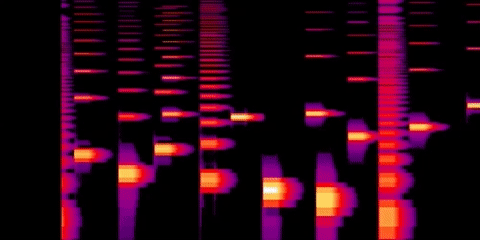

# webaudio-viz

Minimally draws some web audio data to a canvas

[Live demo page](https://andyhall.github.io/webaudio-viz/)



## Usage

```js
import { Viz } from 'webaudio-viz'

var viz = new Viz(ctx, canvas, inputAudioNode, fps, mode)
viz.paused = false

// three draw modes
viz.mode = 0        // frequency bars
viz.mode = 1        // oscilloscope-style waveform
viz.mode = 2        // spectrogram animated over time

// other settings
viz.minDb = -96
viz.maxDb = -15
viz.minFreq = 150
viz.maxFreq = 15000
```

----

### By

Made with 🍺 by [Andy Hall](https://twitter.com/fenomas). License is ISC.


